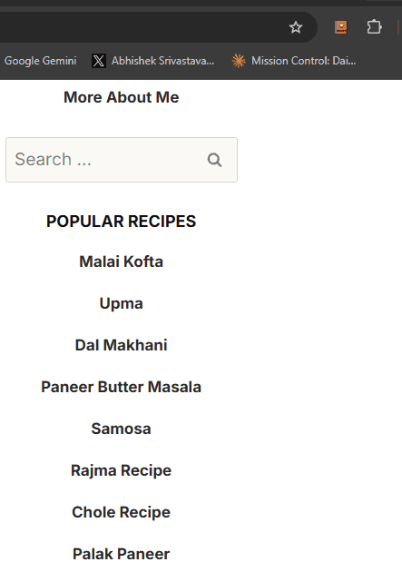

# 🍳 Recipe Rage Cleaner

> **Extract just the recipe. Skip the 3,000-word life story.**
> Instantly bypasses narrative fluff, ancestral background, and aggressive popups to deliver exact ingredients and cooking steps.

---

## 📖 The Problem & The Solution

Every online food blog buries the actual recipe under a mini-novel about the author's childhood, a family trip to Tuscany, three paragraphs on seasonal produce, and a barrage of shifting layout ads.

**Recipe Rage Cleaner** strips all that away in under 3 seconds. It parses the page, isolates the core recipe, extracts exact measurements and cooking steps, and delivers a sarcastic summary of the fluff you just escaped—complete with a diagnostic "Rage Rating".

---

## ⚡ Core Features

- 📈 **Sarcastic Rage Meter** — Computes a layout rage score (0–10) representing how much unnecessary padding and ads you had to scroll through.
- 🥗 **Clean Ingredients List** — Isolates a clean, readable bulleted list with exact measurements and zero filler text.
- 📋 **Bulleted Instructions** — Displays standard numbered cooking steps, optimized for active kitchen viewing.
- 🗣 **"What You Skipped" Fluff Tracker** — Generates a humorous, AI-summarized overview of the blog stories, family history, or local farm writeups you bypassed.
- 🚪 **Wrong Kitchen Detector** — Open a non-food page by mistake? The AI humorously detects this and attempts to list the "ingredients" and "recipes" of whatever site you're currently visiting.
- ⏱ **Instant Word Count Preview** — Displays a progressive layout word count while the underlying Gemini model extracts the recipe text.

---

## 🛠 Getting Started

### 1. Load the Extension
1. Clone this repository locally.
2. Open Chrome and navigate to `chrome://extensions`.
3. Toggle on **Developer mode** in the top right.
4. Click **Load unpacked** and select the `recipe-rage-cleaner` folder.

### 2. Configure Your Keys
Launch the popup and click the **⚙** gear icon to configure your endpoints:
- **Gemini Key** — Get one for free at [aistudio.google.com](https://aistudio.google.com/apikey).
- **OpenRouter Key** (fallback) — Get one at [openrouter.ai](https://openrouter.ai).

> [!WARNING]
> No recipes or personal details are logged. All operations are run locally or queried directly to secure endpoints.

---

## 🔧 Technical Stack

- **Extension Framework**: Chrome Extension Manifest V3
- **Primary AI Engine**: Gemini 2.0 Flash via AI Studio SDK
- **Fallback Engine**: OpenRouter API
- **Client Implementation**: Pure Vanilla JS, no build steps, zero bulky dependencies. Runs directly out of the folder.

---

## 📅 180 Days of Building
This project is part of a larger developer journey: shipping one useful AI tool/extension every day for 180 days.

Follow along for daily releases and tech-stack deep dives:
- **Twitter / X**: [@happy_ships](https://x.com/happy_ships)
- **Day**: `04 / 180`
- **Next Release**: `Sheet Brain`

---

*Licensed under the [MIT License](LICENSE).*
